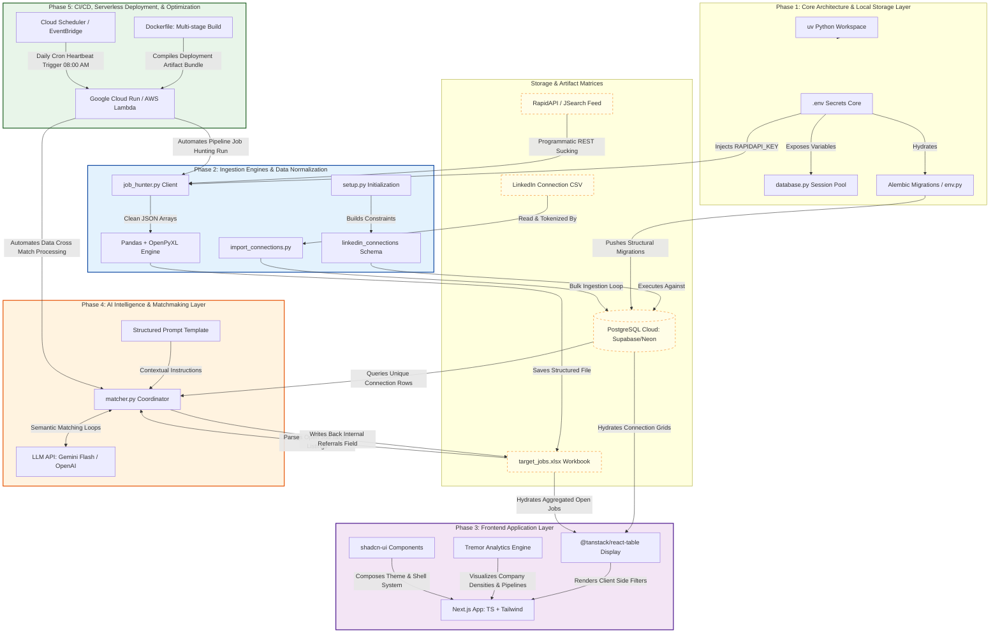

# LinkHunter-AI 🚀
### Autonomous Network Parsing & Job Intelligence Engine

LinkHunter-AI is a full-stack, decoupled data intelligence application designed to convert your professional network records and automated public job marketplace listings into an actionable, referral-ready outreach dashboard. 

By bypassing the traditional corporate recruitment funnel, the system targets high-ticket B2B consulting roles and warm-referral warm paths through programmatic data mining, serverless data pipeline execution, and semantic LLM matchmaking.

---

## 🗺️ System Implementation Roadmap

- **[PHASE 1]** Core Architecture & Setup
  -  └── *Next Step* ➔ **[PHASE 2]** Data Ingestion & Pipelines
      -  └── *Next Step* ➔ **[PHASE 3]** Frontend Application Layer
          -  └── *Next Step* ➔ **[PHASE 4]** AI Matchmaking Core
              -  └── *Final Step* ➔ **[PHASE 5]** CI/CD & Cloud Automation

---

## 🏗️ System Architecture

