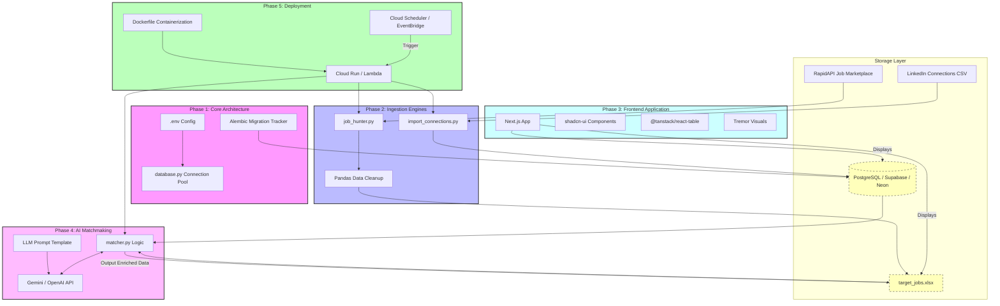

# Project Blueprint: AI-Powered Network & Job Intelligence Platform
### Codename: LinkHunter-AI

This comprehensive specification document is now aligned to the `todo.md` development roadmap. It defines the architecture, data flow, component ownership, and execution phases needed to move from local proof-of-concept to a cloud-enabled referrals intelligence system.

---

## 1. Project Overview & Core Objectives

LinkHunter-AI is designed to convert your LinkedIn connection database and external job listings into a referral-ready matching engine. The platform has four core objectives:

- **Network Ingestion:** Load and normalize LinkedIn-style connection records into a relational database.
- **Job Ingestion:** Collect job openings through authenticated API queries and normalize them into spreadsheet and database-ready formats.
- **AI Matchmaking:** Use semantic analysis to identify referral signals between connections and open roles.
- **Deployment Automation:** Containerize, deploy, and schedule pipeline execution in the cloud for continuous operation.

---

## 2. Implementation Phases & Alignment

### Phase 1: Core Architecture & Local Storage Layer
**Objective:** Establish the development sandbox, relational database structure, and secure environment configuration.
- `uv init` to bootstrap the Python workspace.
- `.env`-based secret configuration for `DATABASE_URL`, `RAPIDAPI_KEY`, and cloud credentials.
- `database.py` to centralize PostgreSQL connection configuration and session management.
- `alembic init migrations` to create migration state and schema version control.
- Configure `migrations/env.py` to load environment variables directly from `.env`.

### Phase 2: Ingestion Engines & Data Normalization
**Objective:** Build ingestion bridges for connection data and job listings, plus normalized storage for analytics.
- `setup.py` to define database table creation and initialization logic.
- `linkedin_connections` schema with explicit `UNIQUE` constraints.
- `import_connections.py` to parse connection CSV files and insert normalized rows into PostgreSQL.
- `job_hunter.py` to call RapidAPI / JSearch, clean JSON payloads, and return structured job records.
- Use `pandas` + `openpyxl` to write normalized job data into `target_jobs.xlsx`.

### Phase 3: Frontend Application Layer
**Objective:** Add a visualization and management interface for connections and jobs.
- Bootstrap a web app using `npx create-next-app@latest --typescript --tailwind`.
- Initialize UI components with `npx shadcn-ui@latest init`.
- Build dashboard UX with sidebar navigation, tables, and dark mode.
- Use `@tanstack/react-table` for connection and job grid data display.
- Add cards and filters that highlight `Internal Referrals Available` status.
- Add visual analytics with `tremor` to show company densities and role pipeline metrics.

### Phase 4: AI Intelligence & Matchmaking Layer
**Objective:** Use an LLM to enrich the database and spreadsheet with referral signals.
- `matcher.py` to load relational rows from PostgreSQL and parse the `target_jobs.xlsx` workbook.
- Define a structured prompt template with system role instructions and few-shot examples.
- Connect to Gemini Flash or OpenAI API for semantic evaluation.
- Detect signals such as:
  - Connection X works at company Y with a current opening.
  - Connection Z has a relevant engineering managerial title for a job.
- Write back an `Internal Referrals Available` field into the output workbook.

### Phase 5: CI/CD, Serverless Deployment, and Optimization
**Objective:** Automate execution and move the pipeline to serverless production.
- Provision a cloud Postgres instance on Supabase or Neon.
- Repoint local config to the production `DATABASE_URL` and cloud deployment secrets.
- Execute `alembic upgrade head` against the cloud database.
- Create a production-ready `Dockerfile` with multi-stage build and dependency caching.
- Deploy the container to Google Cloud Run or AWS Lambda.
- Configure Cloud Scheduler / EventBridge to trigger the pipeline daily.

---

## 3. Architecture Components

| Component | Purpose | Implementation File |
|---|---|---|
| Environment | Secure runtime config | `.env`, `dotenv` loader |
| DB Connection | Postgres session management | `database.py` |
| Schema migration | Versioned DB schema control | `alembic/`, `migrations/env.py` |
| Connections ingest | Normalize CSV connection records | `import_connections.py` |
| Job ingest | Fetch and normalize job listings | `job_hunter.py` |
| Spreadsheet output | Persist jobs and referral fields | `target_jobs.xlsx` |
| Match engine | Compare connections and roles | `matcher.py` |
| Frontend | Dashboard + job board display | Next.js app |
| Deployment | Container + scheduler | `Dockerfile`, Cloud Run / Lambda |

---

## 4. System Architecture Diagram

---

## 5. Follow-the-Todo Guidance

Use `todo.md` as the task checklist and `architecture.md` as the phase-aligned implementation guide. The next immediate development priorities are:

1. Confirm local `uv` workspace and `.env` setup.
2. Build `database.py` and initialize `alembic` migrations.
3. Implement `import_connections.py` and `job_hunter.py`.
4. Add `matcher.py` once job and connection ingestion are stable.
5. Reserve frontend and deployment work until the data pipeline is producing stable output.